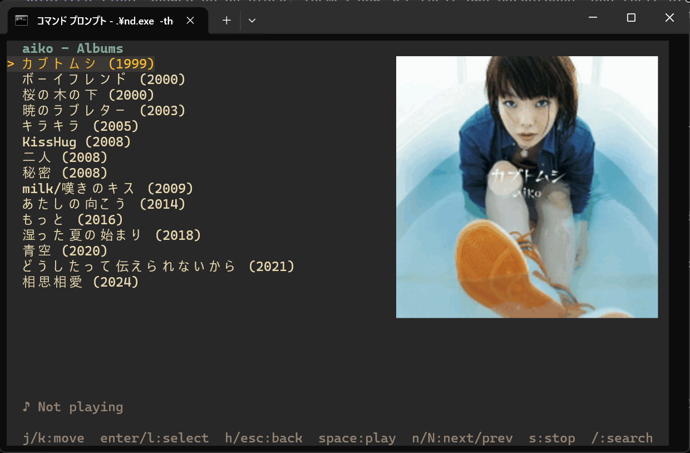

# nd

Terminal-based music player for [Navidrome](https://www.navidrome.org/) (and other Subsonic-compatible servers).




## Features

- Browse artists, albums, and songs
- Playlist support
- Incremental search for songs
- Lyrics display (synced/unsynced)
- Details of artists (biography, similar artists), albums, and songs (format, bitrate, play count...)
- Browse recently added, recently played, most played, top rated, random, and starred albums
- Random play
- Star and rate artists, albums, and songs
- Scrobbling: plays are recorded on the server (and forwarded to Last.fm / ListenBrainz if configured in Navidrome)
- Queue with auto-advance to next track
- Cover art display on sixel-capable terminals
- Color themes (dark and light built-ins, fully customizable)
- Keyboard-driven TUI (powered by [Bubble Tea](https://github.com/charmbracelet/bubbletea))

## Requirements

- [mpv](https://mpv.io/) for audio playback
- Go 1.26+ (only when building from source)

## Install

Download a binary from [Releases](https://github.com/mattn/nd/releases), or build from source:

```
go install github.com/mattn/nd@latest
```

## Usage

```
nd -server http://localhost:4533 -user admin -password yourpass
```

Settings given on the command line are saved to the config file, so after the first run just `nd` is enough.

| Flag | Description |
|------|-------------|
| `-server URL` | Navidrome server URL |
| `-user USER` | Username |
| `-password PASS` | Password |
| `-mpv PATH` | Path to the mpv binary |
| `-theme NAME` | Color theme for this session only (not saved) |
| `-list-themes` | List the built-in themes with a color preview |

## Configuration

The config file is `nd/config.json` in your OS config directory:

- Linux: `~/.config/nd/config.json`
- macOS: `~/Library/Application Support/nd/config.json`
- Windows: `%APPDATA%\nd\config.json`

```json
{
  "server": "http://localhost:4533",
  "user": "admin",
  "password": "your-password",
  "mpv": "/usr/bin/mpv",
  "theme": "gruvbox",
  "colors": {
    "cursor": "#ffb86c"
  },
  "cover": true,
  "scrobble": true
}
```

| Key | Description |
|-----|-------------|
| `server` | Navidrome (Subsonic) server URL |
| `user` | Username |
| `password` | Password |
| `mpv` | Path to the mpv binary. Defaults to `mpv` in your `PATH` |
| `theme` | Built-in color theme. Defaults to `default` |
| `colors` | Per-element color overrides on top of `theme` |
| `cover` | Show cover art on sixel-capable terminals. Defaults to `true` |
| `scrobble` | Record plays on the server. Defaults to `true` |

### Color Themes

| Kind | Themes |
|------|--------|
| Dark | `dracula`, `nord`, `gruvbox`, `catppuccin` |
| Light | `github-light`, `solarized-light`, `gruvbox-light`, `catppuccin-latte` |
| Terminal background | `default`, `mono` |

Dark and light themes paint their own background. `default` and `mono` keep your terminal's background.

Run `nd -list-themes` to preview them, and `nd -theme nord` to try one without changing your config. With `-theme`, `colors` overrides from the config are ignored so you see the theme as is.

To customize, pick a base `theme` and override any of these keys in `colors`. Unspecified keys fall back to the theme.

| Key | Used for |
|-----|----------|
| `background` | Screen background. `"none"` keeps the terminal's background |
| `header` | Title line |
| `normal` | List items |
| `cursor` | Selected item |
| `cursor_bg` | Background of the selected item |
| `dim` | Artist and duration in song lists |
| `playing` | Now playing song |
| `help` | Key help line |
| `error` | Error messages |

Colors are ANSI 256 color numbers (`"212"`) or hex colors (`"#ff79c6"`).

### Cover Art

On terminals that support [sixel](https://en.wikipedia.org/wiki/Sixel) graphics (e.g. Windows Terminal, WezTerm, foot, mlterm, xterm with `-ti vt340`), the cover art is shown next to the list: the album under the cursor in the album list, the song under the cursor in song lists, and the now playing song elsewhere. Support is detected automatically at startup. Set `"cover": false` to turn it off.

## Key Bindings

| Key | Action |
|-----|--------|
| `j` / `k` | Move down / up |
| `g` / `G` | Go to top / bottom |
| `Enter` / `l` | Select / enter |
| `h` / `Esc` / `Backspace` | Go back |
| `Space` | Play selected song |
| `n` / `N` | Next / previous track |
| `s` | Stop playback |
| `/` | Search |
| `L` | Show lyrics |
| `p` | Playlists |
| `a` | Artists |
| `b` | Browse (recently added, most played, random, starred...) |
| `r` | Play random songs |
| `i` | Show details of the selected item |
| `f` | Star / unstar the selected item |
| `1`-`5` / `0` | Rate / clear rating of the selected item |
| `?` | Show help |
| `q` | Quit |

`i`, `f`, and rating keys act on the item under the cursor, or on the now playing song in views without one. In the artist details, select a similar artist to open it.

### Scrobbling

When a song starts, it is reported to the server as now playing. It is recorded as played once it has played for half its length or 4 minutes, whichever comes first (the Last.fm rule). This updates play counts and "recently played" in Navidrome, and is forwarded to Last.fm or ListenBrainz if you have linked them in Navidrome. Set `"scrobble": false` to turn it off.

While searching, results update as you type:

| Key | Action |
|-----|--------|
| `↑` / `↓`, `Ctrl-P` / `Ctrl-N` | Move through results |
| `Enter` | Close the search box and pick from the results |
| `Esc` | Cancel and return to the previous list |

## License

MIT

## Author

Yasuhiro Matsumoto (a.k.a. mattn)
